# 🎬 Live Demo Walkthrough

This document walks through a full end-to-end execution of the drift detection and automated remediation system - from a clean infrastructure state, through drift injection, detection, issue creation, human approval, and verified remediation.

---

## Step 1 - Verify Clean State

Before injecting any drift, the system is confirmed clean. A manual workflow dispatch runs `drift-detection.yml` and the pipeline returns **No Drift Detected** - confirming the baseline infrastructure matches the Terraform state exactly.

.png)        
*Drift Detection #129: drift-detection.yml workflow execution command*


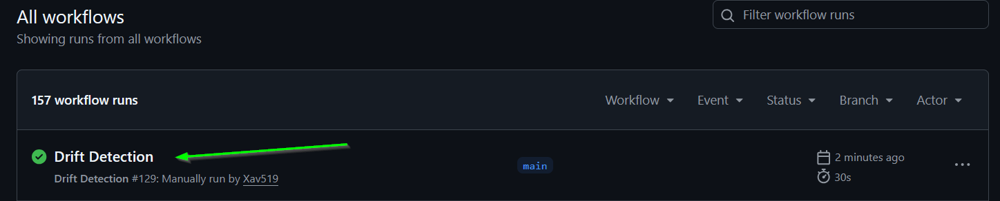
*Workflow list confirming the clean baseline run completed in 30s.*

---

## Step 2 - Inject Drift

Two methods of drift injection are demonstrated: the **automated simulation script** (mimicking a developer making changes via CLI/SDK) and a **manual change directly in the AWS console** (mimicking an engineer making a hotfix during an incident).

### 2a. Script-based injection - all 4 scenarios at once

```bash
python simulate_drift.py --scenario all
```

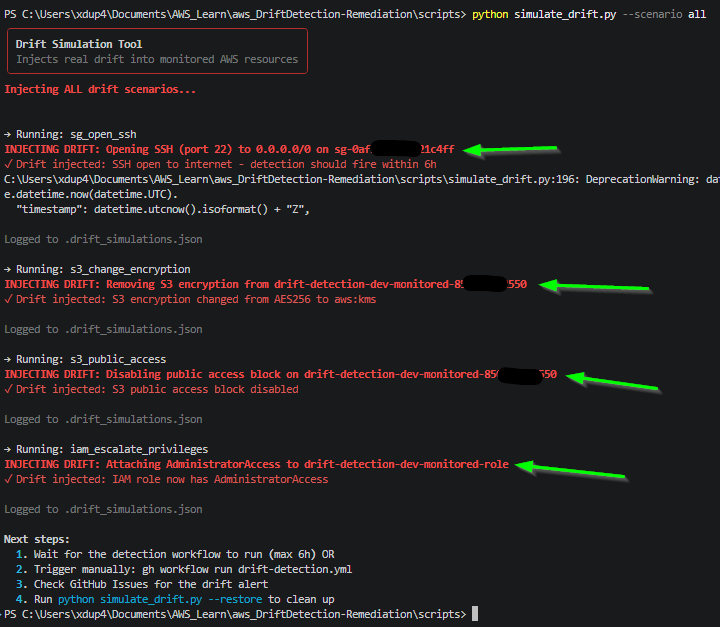        
*The simulation tool injects all four CRITICAL scenarios simultaneously: SSH port 22 opened to `0.0.0.0/0`, S3 encryption changed from AES256 to aws:kms, S3 public access block disabled, and `AdministratorAccess` attached to the monitored IAM role.*

### 2b. Manual change in the AWS console - S3 versioning suspended

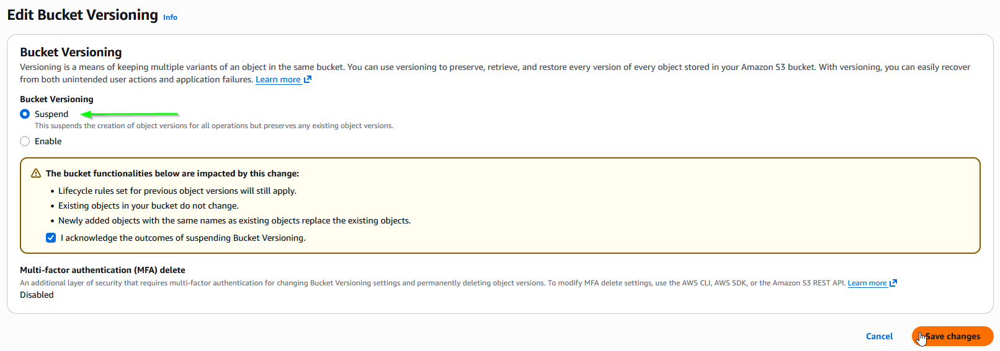
*Bucket versioning manually set to "Suspend" in the AWS console - exactly the kind of out-of-band change this system is designed to catch.*

### 2c. Manual change in the AWS console - resource tag modified

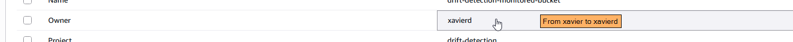
*Resource Owner tag changed from `xavier` to `xavierd` directly in the console. This registers as a LOW severity drift - demonstrating the system catches even non-critical metadata changes.*

---

## Step 3 - Trigger Detection

With drift injected, the detection workflow is triggered manually via the GitHub CLI (in production this runs automatically every 6 hours).

```bash
gh workflow run drift-detection.yml -f environment=dev
```

---

## Step 4 - Review Detection Results

The workflow completes successfully. The step summary reports **6 total drift events, 4 critical**.

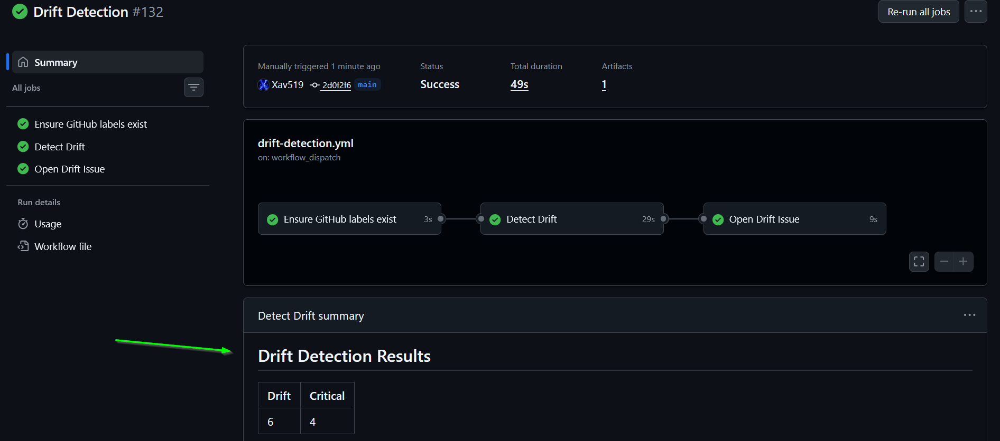
*Drift Detection #132: all three jobs pass. Summary table shows 6 drifted resources with 4 classified as CRITICAL.*

### DynamoDB audit log - queried via CLI

```bash
python ../scripts/query_drift.py --limit 6
```

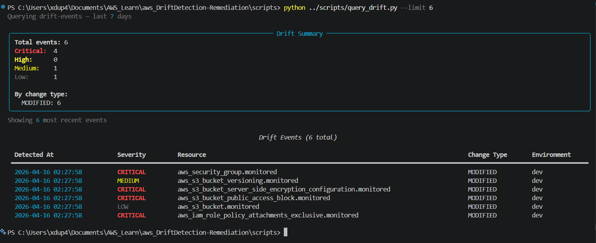
*All 6 events written to DynamoDB with full severity breakdown: 4 CRITICAL, 1 MEDIUM, 1 LOW. Resources affected: Security Group, S3 encryption config, S3 public access block, S3 versioning, S3 bucket metadata (tag), and IAM role policy attachment.*

---

## Step 5 - GitHub Issue Auto-Created

Because critical drift was detected and no open drift issue already existed for the `dev` environment, the workflow automatically opens a GitHub Issue tagged `drift`, `dev`, and `auto-remediate`. The `auto-remediate` label is added via `PAT_TOKEN`, which fires `auto-remediate.yml`.

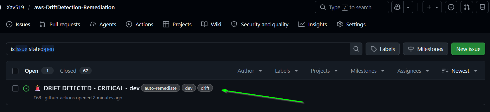
*Issue #68 🚨 DRIFT DETECTED - CRITICAL - dev" opened automatically with all three labels. The `auto-remediate` label immediately triggers the remediation workflow.*

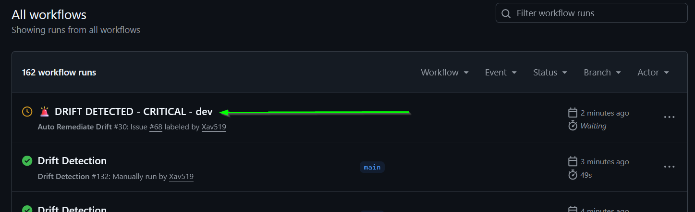
*`auto-remediate.yml` picks up the label event, runs the guard and plan jobs, then pauses at the `remediation` environment gate - waiting for human approval before applying anything.*

---

## Step 6 - Human Approval

An engineer reviews the Terraform plan in the workflow summary, then clicks **Approve and deploy** in the GitHub Environment gate.

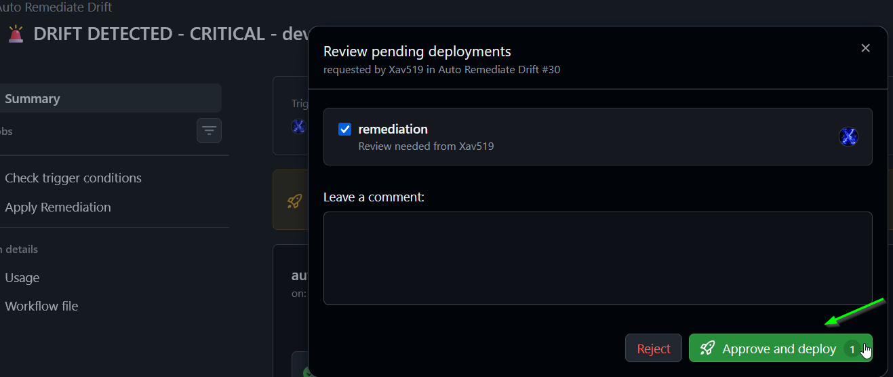
*The "Review pending deployments" modal shows the `remediation` environment requires sign-off from Xav519. After review, "Approve and deploy" is clicked to proceed.*

---

## Step 7 - Remediation Succeeds

`terraform apply` executes against the saved plan. All drifted resources are restored to their intended state. The workflow closes issue #68 with an audit comment and marks it `remediated`.

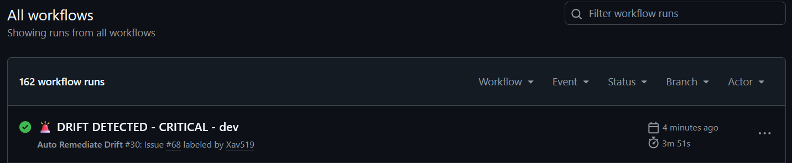
*Auto Remediate Drift #30 completes in 3m 51s. The issue is closed automatically with a timestamped comment and the remediation event is recorded in DynamoDB.*

---

## Step 8 - Final Verification

A final manual run of `drift-detection.yml` confirms the infrastructure is fully clean after remediation. No drift is detected.

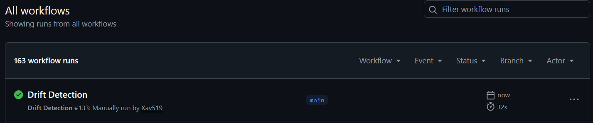
*Workflow list showing the final drift detection run completed in 32s.*

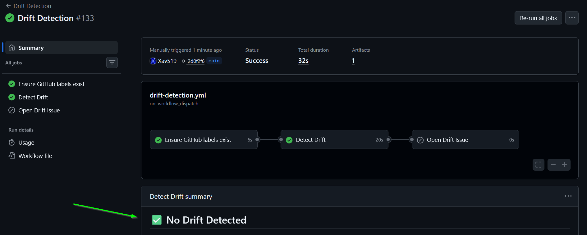
*Drift Detection #133: summary confirms **No Drift Detected**. The full cycle - inject → detect → alert → approve → remediate → verify - is complete.*


---

## Full Cycle Summary

| Step | Action | Result |
|------|--------|--------|
| 1 | Verify baseline | ✅ No drift |
| 2 | Inject 6 drift events (script + manual console) | 4 CRITICAL, 1 MEDIUM, 1 LOW |
| 3 | Trigger detection workflow | Drift detected, Lambda invoked, DynamoDB written |
| 4 | GitHub Issue auto-opened | Issue #68 with `auto-remediate` label via PAT |
| 5 | Remediation workflow triggered | Paused at approval gate |
| 6 | Human approves | `terraform apply` executes |
| 7 | Remediation completes | Issue closed, audit record written |
| 8 | Final verification | ✅ No drift - clean state restored |
